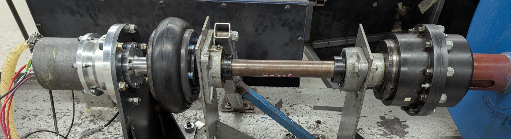

<p align="center">
  
</p>


## Overview


The RMIT dyno setup consists of two systems, the dyno controller panel (DCS800) and r19e/r26 ECU. This allows for the car's powertrain system to be validated before implementation into the car. The ECU controls the motor and HV system. However, for this test setup it is also meant to transmit a `0-3.3 V @ 10 kHz` PWM signal to control the dyno RPM. This allows for a lookup table to be used to ramp up the dyno RPM in an arbitrary function.

> [!NOTE]
> ECU-side board can be found [here](ecu-side) & dyno-side board can be found [here](dyno-side).

## Why communicate? 

The 2026 dyno setup uses speed control on the dyno-side and torque control on the load motor. This allows for a lookup table to be used to ramp up the dyno RPM to model RPM vs torque. For example, the dyno-side RPM over time could be modelled as this arbitrary function:

$$ RPM(t) = \frac{A}{2B}(1-\cos(\frac{\pi t}{t_{total}})), \quad RPM(t) \in [0, dyno_{max}] $$

Where `A` is the target RPM at the load side, `B` is the gearing ratio between the dyno motor and load motor, and `t_total` is the total time to reach that requested RPM. The requested RPM then needs to be converted to duty cycle:

$$ DC(t) = (\frac{C \times RPM(t)}{2})(\frac{3.3}{5})(\frac{100}{3.3})$$
$$ DC(t) = 10C \times RPM(t), \quad DC(t) \in [0, 100]$$

And then it would simply be transformed into a simple lookup table, assuming `C` is the dyno controller input scaling factor `(V/RPM)` after the 2× amplification stage.

> [!important]
> The dyno has a `200 kΩ` input impedance (AI1) and an analog range of `0–10 V` with a linear factor of `5 mV/RPM`. The r26 powertrain has a gearing of `1:12.81`. Driving frequency table (ARR), output ripple at the dyno, and duty-cycle resolution trade-offs can be found [here](domain-side/readme.md).

| Step | Time (s) | ECU Duty Cycle (%) | Dyno Controller Input (V) | Target Dyno (RPM) | Target Load (RPM) |
| :--- | :---: | :---: | :---: | :---: | :---: |
| 0 | 0.00 | 0.00 | 0.0  | 0  | 0 |
| 1 | 0.25 | 0.26 | 0.03 | 5  | 64 |
| 2 | 0.50 | 0.98 | 0.10 | 20 | 256 |   
| 3 | 0.75 | 1.95 | 0.20 | 39 | 500 |
| 4 | 1.00 | 2.93 | 0.29 | 59 | 755 |
| 5 | 1.25 | 3.64 | 0.36 | 73 | 935 |
| 6 | 1.50 | 3.90 | 0.39 | 78 | 999 |

*Figure 1: Example profile parameters configured for a real-time `1.5-second` window with time steps of `250 ms` using `A = 1000`, `B = 12.81`, and `c = 0.005`.*

> [!note]
> The program used to generate that table can be found [here](domain-side/example_profiles.py)

However, for the real system, race day data is used to model the dynamic torque loading on the load motor. 

## High-level Topology

The dyno controller and r19e ECU are approximately `2-4 meters` apart and operate at different voltage levels (`0-3.3V` vs `0-10V`). So an ECU conditioning/isolation board is used, and a dyno receiver/amplification board is used.


```
Interface (2.54mm Pitch Male Header)
ECU PWM Source (Digital 3.3 V - PB13, tim1_CHN1, STM32F405RGT6)
                    ↓

Interface (jst xh 4 pin 2.5mm)
ECU Side (3.3 V logic / 5 V domain) (conditioning / isolation)
--------------------------------------------
Schmitt trigger (Cleans up the signal edge)
    ↓
Digital Isolator (Isolates the PWM signal) ← (Isolated 5 V domain)
    ↓
RS-422 Driver (A/B differential pair)
-------------------------------------------- 
Interface Socket (RJ45)
                    ↓

CAT 5/6 Cable
--------------------------------------------
twisted pairs: (+signal, -signal)
--------------------------------------------
                    ↓

Interface Socket (RJ45)
DYNO Side (5 / 10 V domain) (receiver / amplification) 
--------------------------------------------
RS-422 receiver (Differential input, rejects noise) ← (5 V LDO)
    ↓
RC low-pass filter (50 Hz) (PWM to DC voltage conversion)
NOTE:
Ripple magnitude depends on PWM frequency,
filter capacitance, and filter resistance.
    ↓
Op-amp 2× Gain (non-inverting) (Scales to 0–10V ADC input range)
--------------------------------------------- 
Interface (jst xh 4 pin 2.5mm)
                    ↓
Interface (4 pin barrel jack) (Unknown Specifics)
DYNO Controller (Analog 10V Input)
```

> [!NOTE]
> Universal Case design: [Available here (Fusion source files)](domain-side/pcb_case/)
> - IGES format included for users without Fusion
> - 4× M3 inserts for mounting PCB and top housing
> - Velcro recommended to secure the housing to the test bench

## Documentation

All internal documentation can be found within this repo's [issues](https://github.com/rmit-wgbowley/dyno-boards/issues?q=state%3Aclosed).
